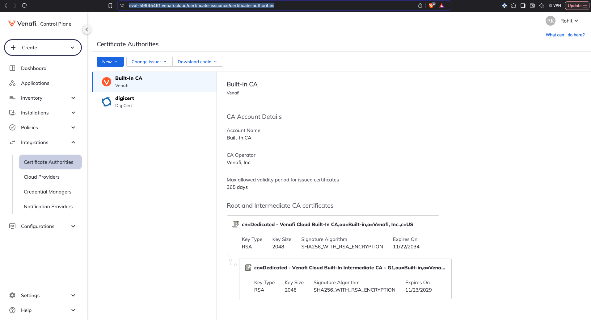
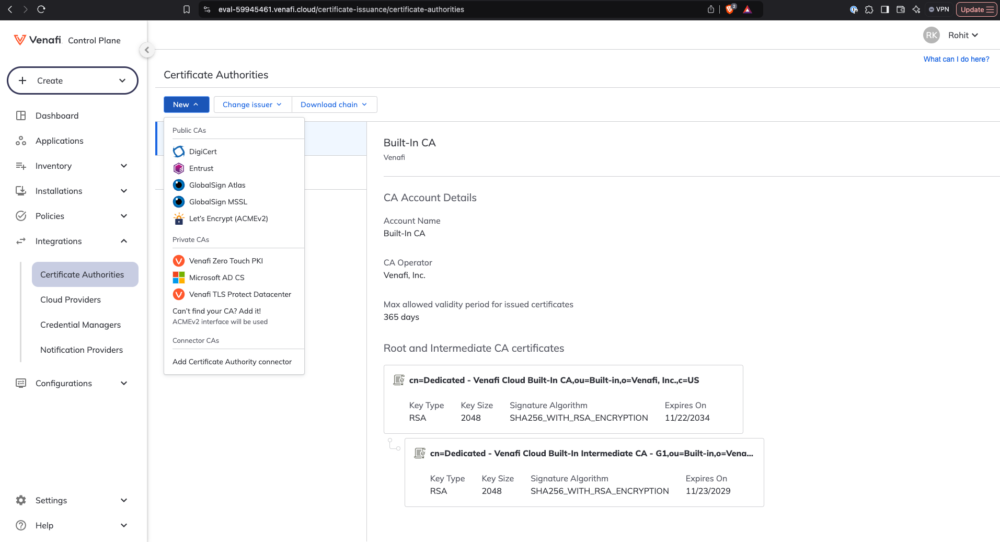
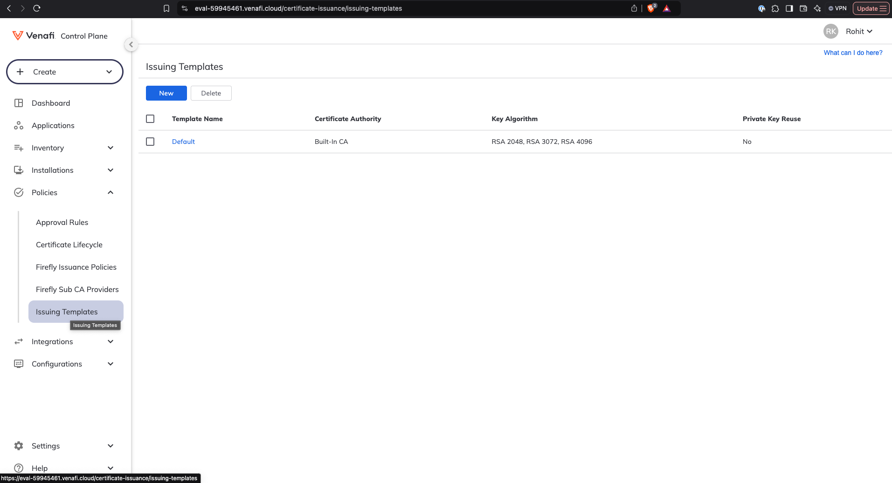
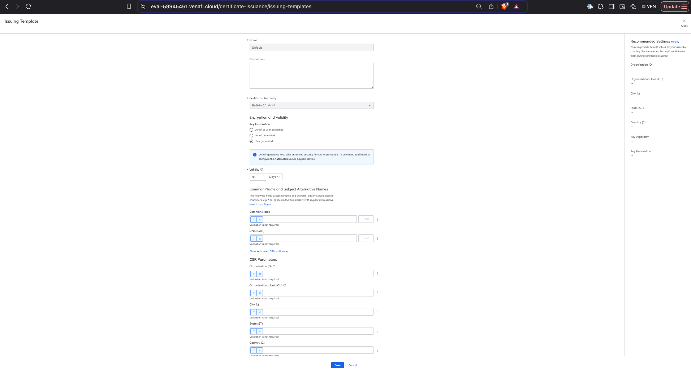
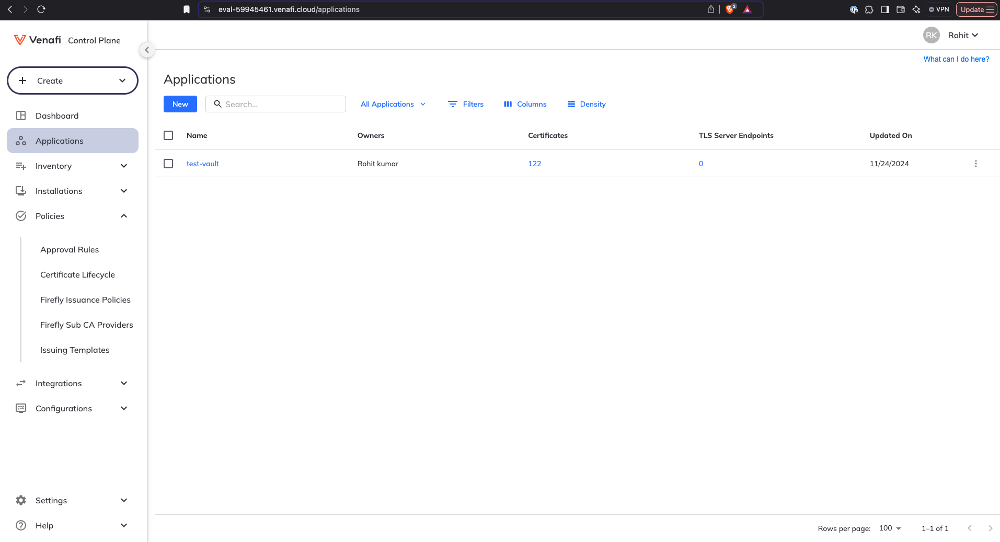
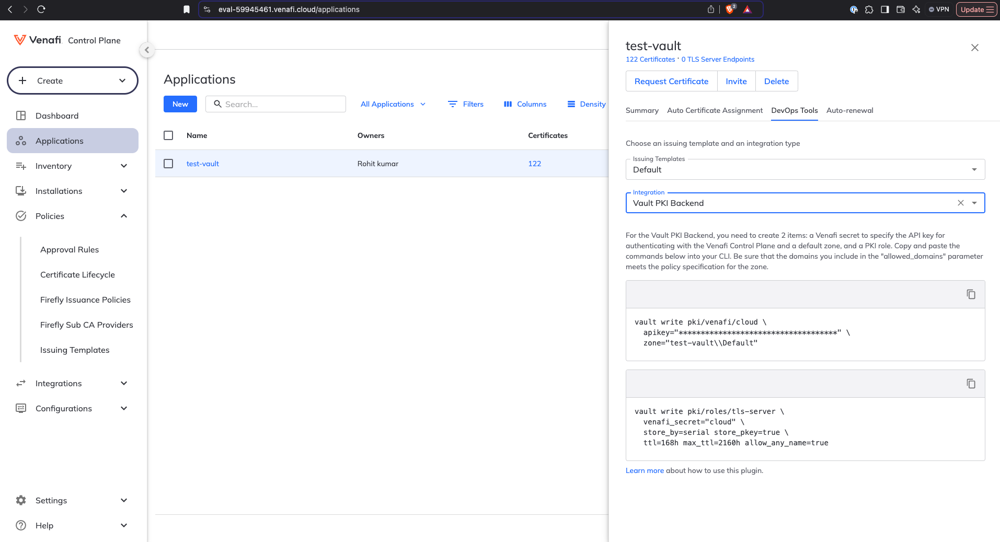
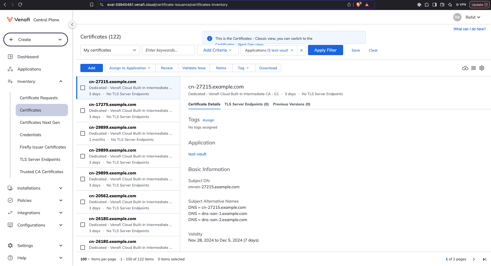

## Venafi Cloud Demo With HashiCorp Vault

### Venafi Cloud Account Setup

#### Step 1: Set Up a Trial Account
1. Use your HashiCorp email to create a trial account at [Venafi Cloud](https://venafi.com/try-venafi/tls-protect/).
2. After creating and verifying the account, log in to Venafi Cloud.

#### Step 2: Create a Certificate Authority (CA)
1. Navigate to **Integrations** -> **Certificate Authorities**.
2. Use the built-in CA provided by Venafi. Alternatively, you can add a new CA.

<br><br>

<br><br><br>

<br><br>

#### Step 3: Create Issuing Templates
1. Navigate to **Policies** -> **Issuing Templates**.
2. Use the built-in template for CA configuration, which includes settings like CN, DSN, CA, expiry, etc. Additonaly you can create a new template as per your need.

<br><br>

<br><br><br>

<br><br><br>

#### Step 4: Create an Application
Now we will Create an application which will have the configuration to utilize the above created template to Issue the certificates. It’s like a Container for all the certificates being issued using this template. This application will also have a separate apikey which will be used for integration with Hashicorp vault PKI engine.

1. Navigate to **Applications** -> **New**.
2. Select the issuing template and assign an account owner.

<br><br>

<br><br><br>

3. Once the application is created:
   - Click on the application to open the side menu.
   - Go to the **DevOps Tools** tab.
   - Select the issuing template for the field and **Vault PKI Backend** for the integration.
4. This will display commands for integrating with HashiCorp Vault and configuring Vault roles.

<br><br>

<br><br>

The Venafi account setup is now complete.

---

### Setup Vault with Venafi Cloud

#### Integration Steps
1. Follow the detailed instructions for **Venafi as a Service** provided [here](https://github.com/Venafi/vault-pki-backend-venafi).
2. High-level steps include:
   - Downloading the Venafi plugin for Vault PKI.
   - Enabling the plugin.
   - Enabling the secret engine.
   - Configuring the secret engine.
   - Creating roles for the engine.

#### Issuing Certificates
Once the integration is complete, you can issue certificates using Vault Cli(steps provided in above steps).
To view issued certificates:
- Go to **Applications** -> your application.
- Or navigate to **Inventory** -> **Certificates**.

<br><br>


#### BenchMarking

##### Venafi Cloud PKI
```
$ time (for i in {1..100}; do  vault write venafi-pki/issue/cloud common_name="test-${i}.example.com" alt_names="dns-san-test-${i}.example.com"; done)
0.09s user
0.14s system
0% cpu
3:47.56 total
```

##### HashiCorp Vault PKI
```
$ time (for i in {1..100}; do vault write pki_int/issue/example-dot-com common_name="test-${i}.example.com" alt_names="dns-san-test-${i}.example.com"; done)
0.08s user
0.13s system
0% cpu
1:27.73 total
```